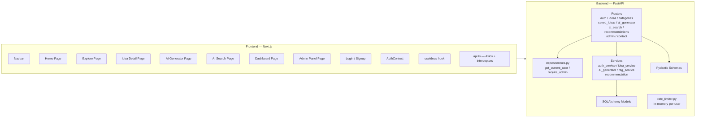
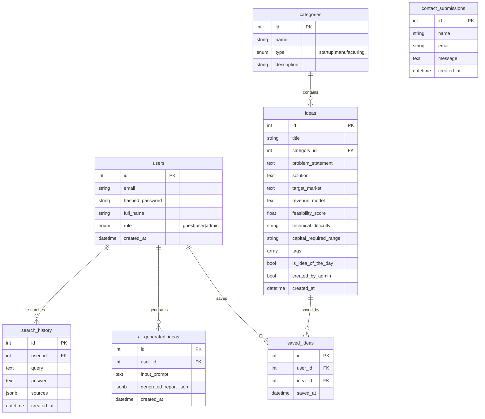
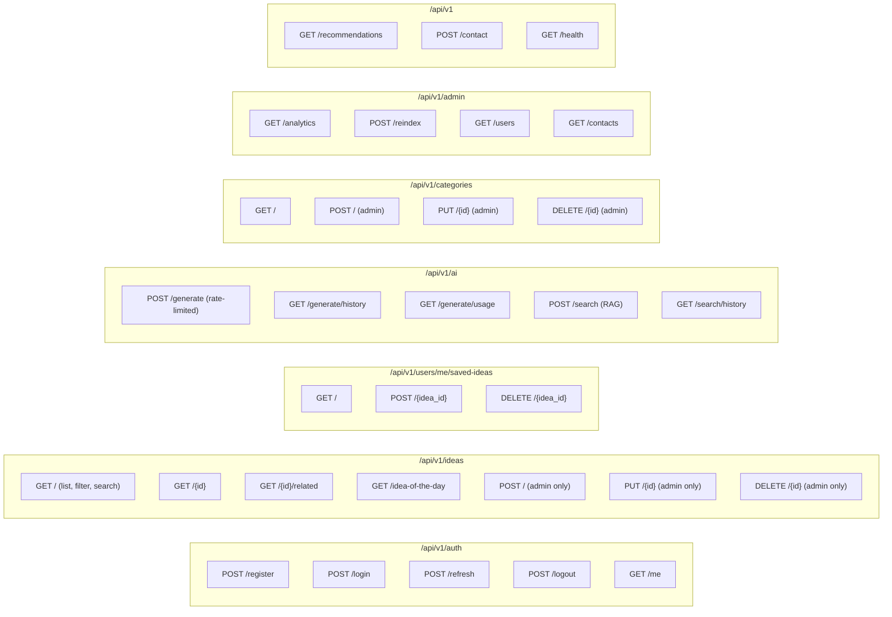
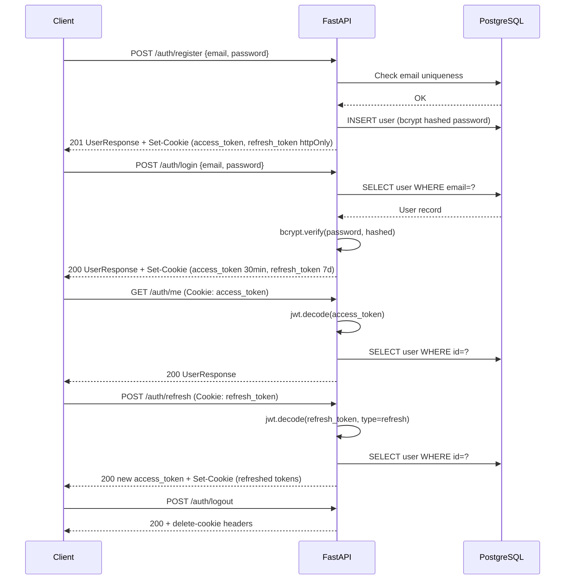
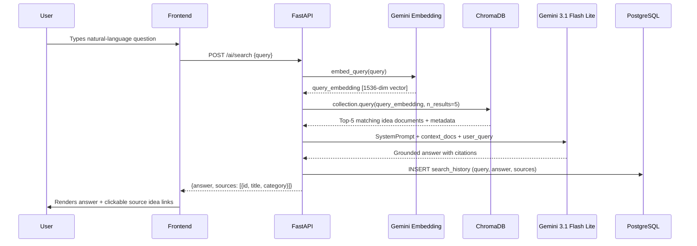
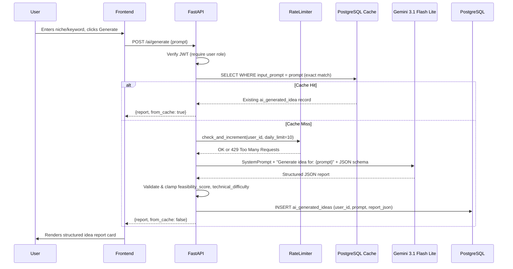
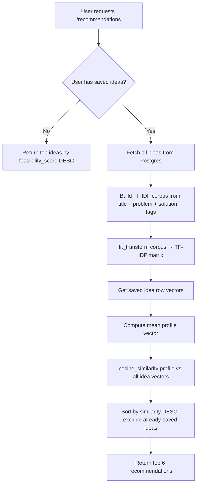
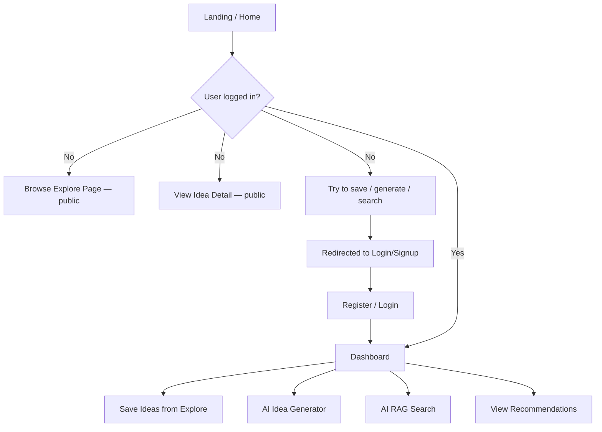
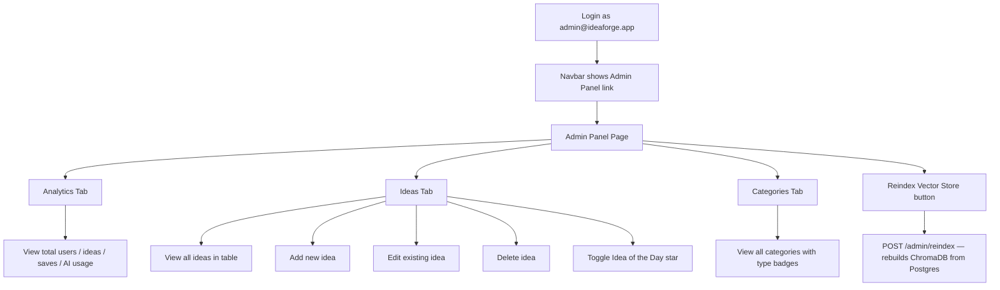

# IdeaForge — Architecture Documentation

## 1. High-Level System Architecture

```mermaid
graph TB
    User["👤 User / Browser"]
    FE["Frontend\nNext.js 14 (App Router)\nVercel"]
    BE["Backend\nFastAPI (Python 3.11)\nRender"]
    DB["PostgreSQL\nNeon/Supabase"]
    VEC["ChromaDB\nPersistent Local\n(Render Disk)"]
    GEMINI["Google Gemini API\n3.1 Flash Lite + Embedding 001\nvia LangChain"]

    User -->|HTTPS| FE
    FE -->|REST API (httpOnly cookies)| BE
    BE -->|SQLAlchemy ORM| DB
    BE -->|chromadb client| VEC
    BE -->|langchain-google-genai| GEMINI
```

## 2. Component Diagram



## 3. Database ER Diagram



## 4. API Architecture



## 5. Authentication Flow



## 6. RAG Pipeline Flow



## 7. AI Idea Generator Flow



## 8. Recommendation Engine Flow



## 9. Full Folder Structure

```
IdeaForge/
├── .gitignore
├── README.md
├── backend/
│   ├── .env.example               # Backend env var template
│   ├── requirements.txt           # Python dependencies
│   ├── alembic.ini                # Alembic config
│   ├── alembic/
│   │   ├── env.py                 # Migration env setup
│   │   ├── script.py.mako         # Migration template
│   │   └── versions/
│   │       └── 0001_initial_schema.py  # Full schema migration
│   ├── app/
│   │   ├── __init__.py
│   │   ├── main.py                # FastAPI app, CORS, router registration
│   │   ├── config.py              # pydantic-settings (all env vars)
│   │   ├── database.py            # SQLAlchemy engine, session, Base
│   │   ├── dependencies.py        # get_current_user, get_optional_user, require_admin
│   │   ├── models/                # SQLAlchemy ORM models
│   │   │   ├── user.py            # User (id, email, hashed_password, role)
│   │   │   ├── category.py        # Category (id, name, type)
│   │   │   ├── idea.py            # Idea (full schema incl. feasibility, tags, IOTD)
│   │   │   ├── saved_idea.py      # SavedIdea (user_id, idea_id, unique constraint)
│   │   │   ├── ai_generated_idea.py  # AIGeneratedIdea (prompt → JSONB report)
│   │   │   ├── search_history.py  # SearchHistory (query, answer, sources JSONB)
│   │   │   └── contact.py         # ContactSubmission
│   │   ├── schemas/               # Pydantic schemas
│   │   │   ├── auth.py            # RegisterRequest, LoginRequest, UserResponse
│   │   │   ├── idea.py            # IdeaCreate/Update/Response, IdeaListResponse
│   │   │   └── ai.py              # GenerateIdeaRequest/Response, AISearchRequest/Response
│   │   ├── routers/               # FastAPI route handlers
│   │   │   ├── auth.py            # /auth/*
│   │   │   ├── ideas.py           # /ideas/*
│   │   │   ├── categories.py      # /categories/*
│   │   │   ├── saved_ideas.py     # /users/me/saved-ideas/*
│   │   │   ├── ai_generator.py    # /ai/generate
│   │   │   ├── ai_search.py       # /ai/search
│   │   │   ├── admin.py           # /admin/*
│   │   │   ├── contact.py         # /contact
│   │   │   └── recommendations.py # /recommendations
│   │   ├── services/              # Business logic
│   │   │   ├── auth_service.py    # JWT creation/verify, bcrypt, user CRUD
│   │   │   ├── idea_service.py    # Ideas CRUD + filtering + IOTD
│   │   │   ├── ai_generator.py    # Gemini prompt → structured JSON report
│   │   │   ├── rag_service.py     # ChromaDB index + embed + retrieve + generate
│   │   │   └── recommendation.py  # TF-IDF cosine similarity recommender
│   │   └── middleware/
│   │       └── rate_limiter.py    # In-memory per-user daily rate limit
│   ├── scripts/
│   │   └── seed.py                # Seed 25 ideas + 8 categories + 2 users
│   └── tests/
│       ├── conftest.py            # SQLite test DB, fixtures
│       ├── test_auth.py           # Register, login, me, logout, role tests
│       ├── test_ideas.py          # CRUD, filters, save/unsave tests
│       ├── test_ai_generator.py   # Generator + cache + rate limit (mocked)
│       └── test_rag_search.py     # RAG search + history (mocked)
└── frontend/
    ├── .env.example
    ├── package.json
    ├── next.config.ts
    ├── tailwind.config.ts
    ├── tsconfig.json
    └── src/
        ├── app/
        │   ├── layout.tsx          # Root layout (fonts, AuthProvider, Toaster)
        │   ├── globals.css         # Tailwind base + custom scrollbar
        │   ├── page.tsx            # Home (IOTD, features, category browser)
        │   ├── explore/page.tsx    # Filterable idea grid
        │   ├── explore/[id]/page.tsx  # Idea detail + related ideas
        │   ├── generate/page.tsx   # AI Idea Generator with usage meter
        │   ├── search/page.tsx     # RAG AI Search chat interface
        │   ├── dashboard/page.tsx  # User dashboard (4 tabs)
        │   ├── admin/page.tsx      # Admin panel (analytics + idea CRUD)
        │   ├── about/page.tsx      # About + AI justification
        │   ├── contact/page.tsx    # Contact form
        │   ├── login/page.tsx      # Login form
        │   └── signup/page.tsx     # Registration form
        ├── components/
        │   ├── layout/Navbar.tsx   # Sticky navbar, auth-aware, mobile hamburger
        │   ├── layout/Footer.tsx   # Footer with nav links
        │   ├── ui/Button.tsx       # 5 variants (primary, secondary, ghost, danger, ai)
        │   ├── ui/Badge.tsx        # 6 variants
        │   ├── ui/Card.tsx         # Card + CardHeader + CardContent
        │   ├── ui/Input.tsx        # Input + Textarea with label/error/icon
        │   ├── ui/Skeleton.tsx     # Skeleton + IdeaCardSkeleton + IdeaGridSkeleton
        │   ├── ui/EmptyState.tsx   # Empty state with icon + CTA
        │   ├── ui/FeasibilityGauge.tsx  # SVG circular gauge (3 sizes)
        │   ├── ideas/IdeaCard.tsx  # Idea card with save toggle
        │   └── ideas/IdeaFilters.tsx    # Filter panel (search, category, difficulty, feasibility)
        ├── context/AuthContext.tsx # Auth state + login/register/logout
        ├── hooks/useIdeas.ts       # Idea fetching + save/unsave
        ├── lib/api.ts              # Axios instance + refresh token interceptor
        ├── lib/utils.ts            # cn(), formatDate(), getFeasibilityColor()
        └── types/index.ts          # All shared TypeScript interfaces
```

## 10. User Journey Diagrams

### Guest and Registered User Journey



### Admin Journey


