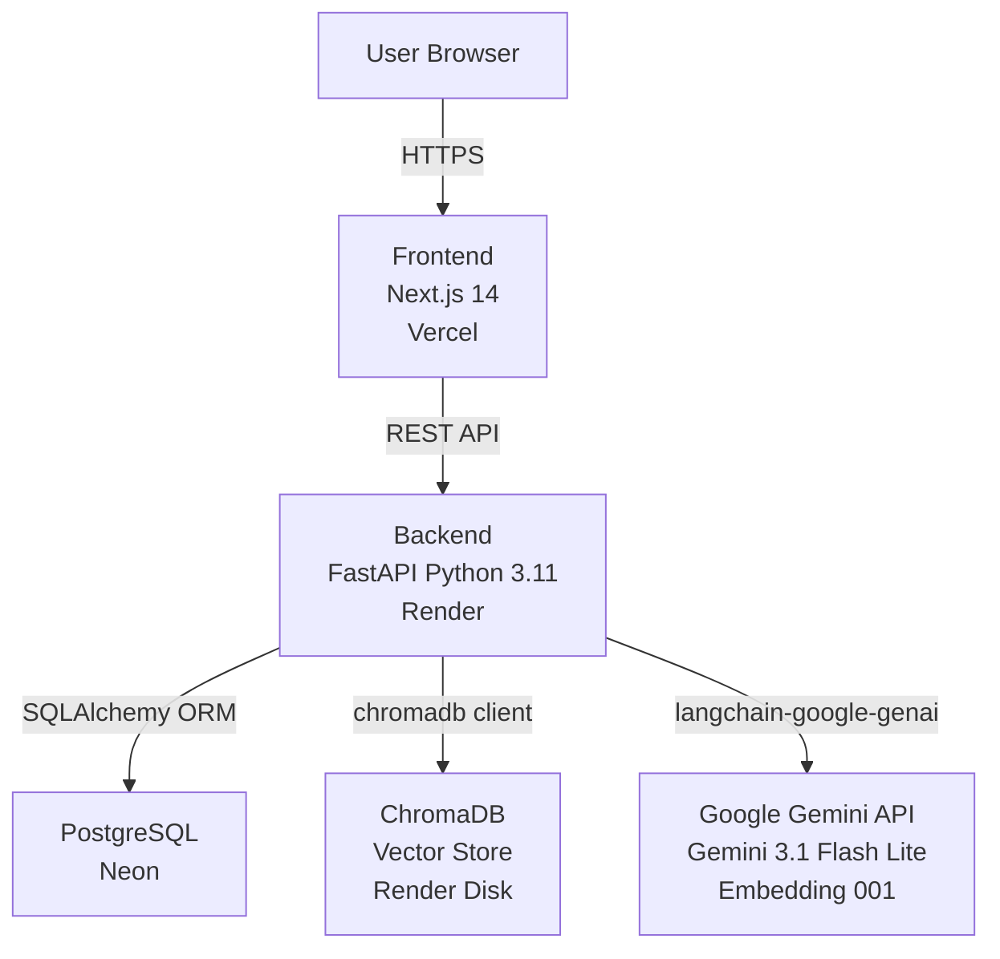
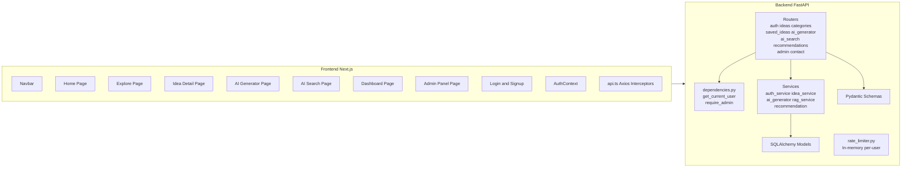
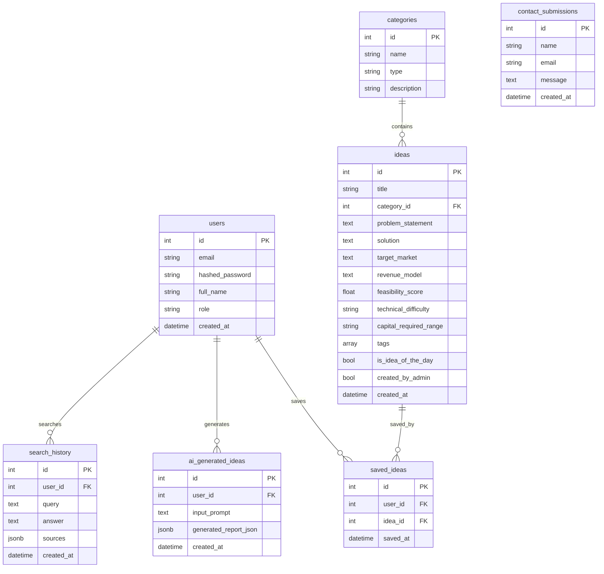
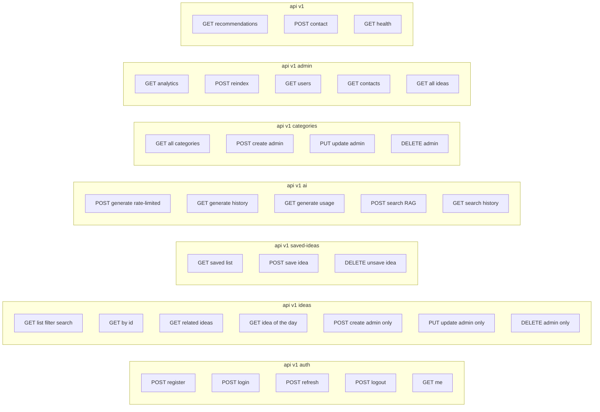
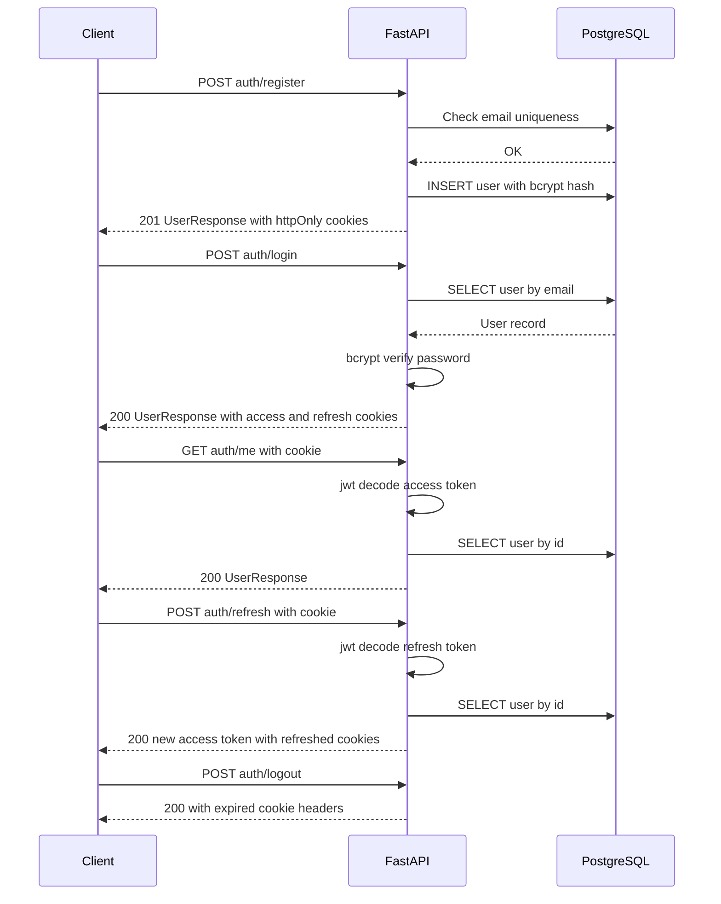
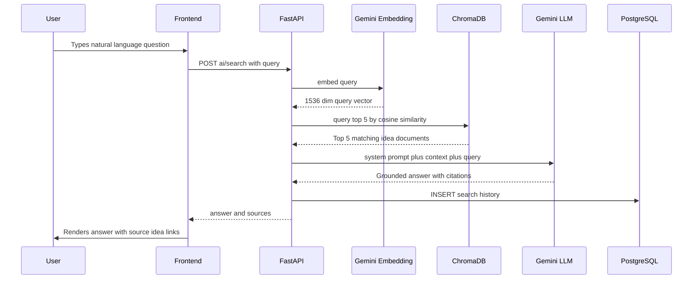
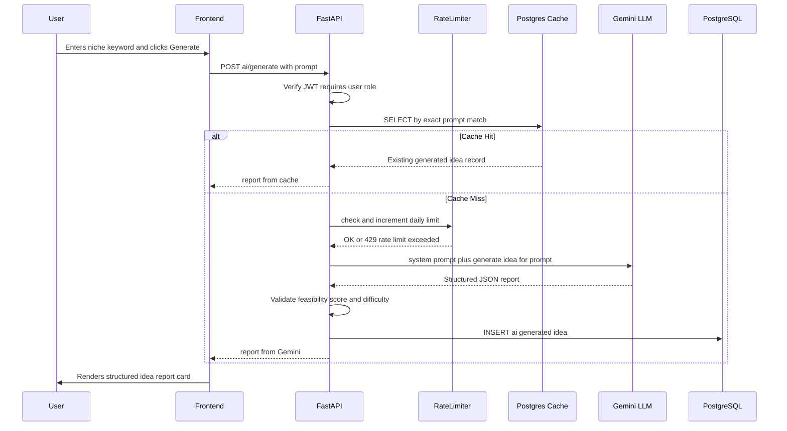
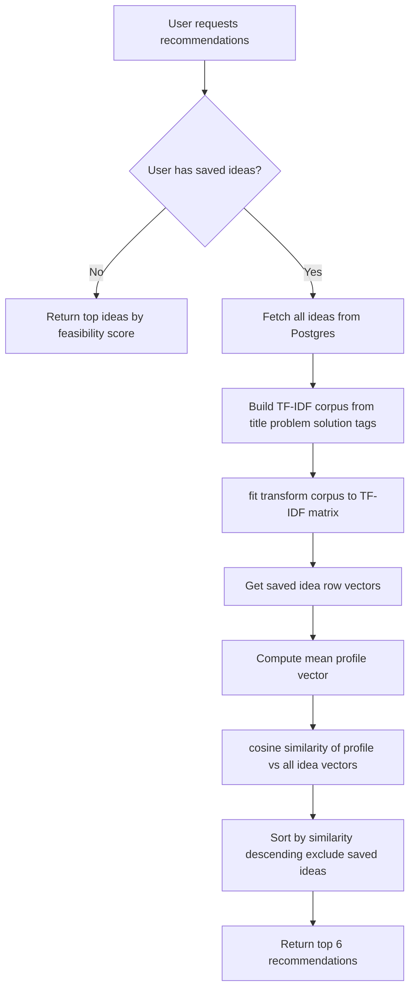
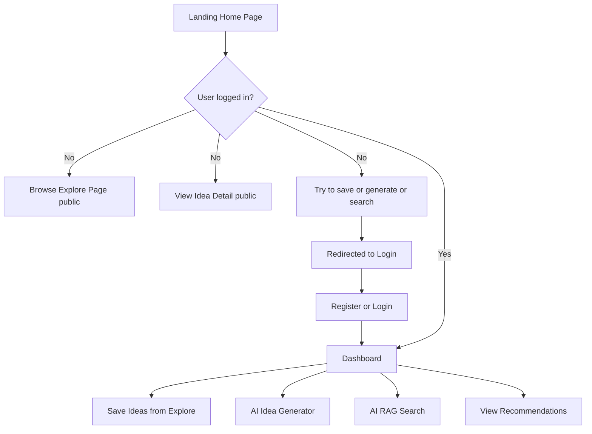
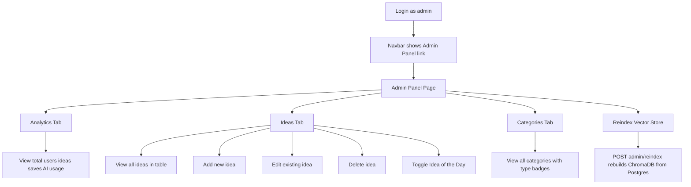

# IdeaForge — Architecture Documentation

## 1. High-Level System Architecture



## 2. Component Diagram



## 3. Database ER Diagram



## 4. API Architecture



## 5. Authentication Flow



## 6. RAG Pipeline Flow



## 7. AI Idea Generator Flow



## 8. Recommendation Engine Flow



## 9. Full Folder Structure

```
IdeaForge/
├── .gitignore
├── README.md
├── render.yaml
├── submission.html
├── backend/
│   ├── .env.example
│   ├── requirements.txt
│   ├── runtime.txt
│   ├── start.sh
│   ├── Dockerfile
│   ├── alembic.ini
│   ├── alembic/
│   │   └── versions/
│   │       └── 0001_initial_schema.py
│   ├── app/
│   │   ├── main.py
│   │   ├── config.py
│   │   ├── database.py
│   │   ├── dependencies.py
│   │   ├── models/
│   │   │   ├── user.py
│   │   │   ├── category.py
│   │   │   ├── idea.py
│   │   │   ├── saved_idea.py
│   │   │   ├── ai_generated_idea.py
│   │   │   ├── search_history.py
│   │   │   └── contact.py
│   │   ├── schemas/
│   │   │   ├── auth.py
│   │   │   ├── idea.py
│   │   │   └── ai.py
│   │   ├── routers/
│   │   │   ├── auth.py
│   │   │   ├── ideas.py
│   │   │   ├── categories.py
│   │   │   ├── saved_ideas.py
│   │   │   ├── ai_generator.py
│   │   │   ├── ai_search.py
│   │   │   ├── admin.py
│   │   │   ├── contact.py
│   │   │   └── recommendations.py
│   │   ├── services/
│   │   │   ├── auth_service.py
│   │   │   ├── idea_service.py
│   │   │   ├── ai_generator.py
│   │   │   ├── rag_service.py
│   │   │   └── recommendation.py
│   │   └── middleware/
│   │       └── rate_limiter.py
│   ├── scripts/
│   │   └── seed.py
│   └── tests/
│       ├── conftest.py
│       ├── test_auth.py
│       ├── test_ideas.py
│       ├── test_ai_generator.py
│       └── test_rag_search.py
└── frontend/
    ├── .env.example
    ├── package.json
    ├── next.config.js
    ├── tailwind.config.ts
    ├── tsconfig.json
    └── src/
        ├── app/
        │   ├── layout.tsx
        │   ├── globals.css
        │   ├── page.tsx
        │   ├── explore/page.tsx
        │   ├── explore/[id]/page.tsx
        │   ├── generate/page.tsx
        │   ├── search/page.tsx
        │   ├── dashboard/page.tsx
        │   ├── admin/page.tsx
        │   ├── about/page.tsx
        │   ├── contact/page.tsx
        │   ├── login/page.tsx
        │   └── signup/page.tsx
        ├── components/
        │   ├── layout/Navbar.tsx
        │   ├── layout/Footer.tsx
        │   ├── ui/Button.tsx
        │   ├── ui/Badge.tsx
        │   ├── ui/Card.tsx
        │   ├── ui/Input.tsx
        │   ├── ui/Skeleton.tsx
        │   ├── ui/EmptyState.tsx
        │   ├── ui/FeasibilityGauge.tsx
        │   ├── ideas/IdeaCard.tsx
        │   └── ideas/IdeaFilters.tsx
        ├── context/AuthContext.tsx
        ├── hooks/useIdeas.ts
        ├── lib/api.ts
        ├── lib/utils.ts
        └── types/index.ts
```

## 10. User Journey Diagrams

### Guest and Registered User Journey



### Admin Journey


